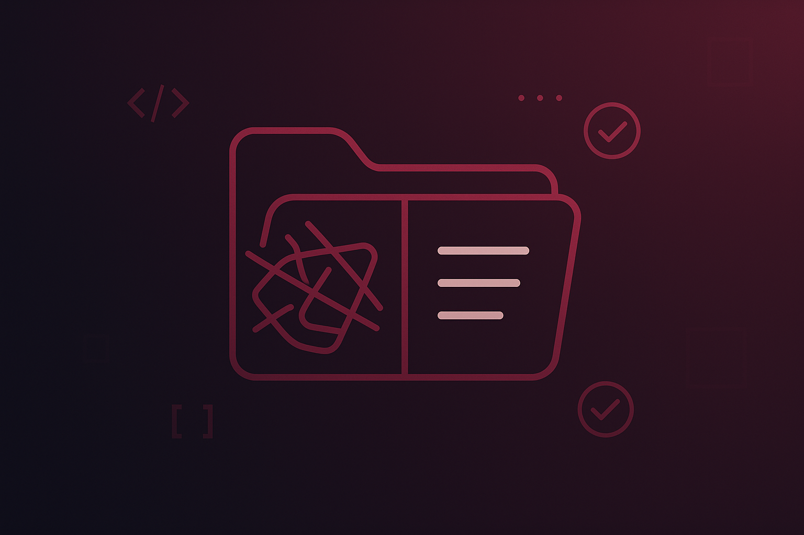

**🇩🇪 Deutsch** | [🇬🇧 English](README.en.md)

<table><tr>
<td width="160"></td>
<td>

# Greg's Business Skills **v1.3.0**

**Wie Neo in Matrix die Kampfkunst — nur in Business-Kunst. Skills einklinken, Struktur downloaden, loslegen.**

</td>
</tr></table>

Schon mal ein neues Projekt gestartet und 20 Minuten damit verbracht, Claude den Kontext zu erklären — nur um das in der nächsten Session nochmal zu machen? Oder einen Projektordner nach zwei Wochen geöffnet und keine Ahnung gehabt, wo du aufgehört hast?

Ob du den Typ kennst oder selber einer bist: 147 Dateien auf dem Schreibtisch, darunter „Entwurf_v3_FINAL_wirklich-final-jetzt-aber-echt-final-superfinal.docx". Und dann wundert man sich, warum Claude dich irgendwann mit „Hugo" anspricht... Kein Urteil — wir waren alle schon da.

Hier ist die Sache: **Claude ist nur so gut wie der Kontext, den du ihm gibst.** Das nennt sich Context Engineering — und es ist der Unterschied zwischen einer KI die dich mit "Hugo" anspricht und einer die dein Projekt besser kennt als du selbst.

Diese Skills sind automatisiertes Context Engineering. Du laberst einfach drauflos — und Claude macht daraus eine Projektstruktur, die auch nach Wochen und Monaten noch funktioniert. Claude geht mit dir auch größere Projekte sauber bis zum Ende — und spricht nur echte Hugos mit Hugo an.

---

## Greg's Project Cockpit 🎯

**Projekte sauber starten. Sauber halten.**

Dein erstes Skill-Bundle. Zwei Skills für Strukturbedürftige und Excellence-Lovers:

```
  /projekt-starten              /projekt-review
  +----------------+            +----------------+
  | SAUBER         |            | SAUBER         |
  | STARTEN        |            | HALTEN         |
  |                | -------->  |                |
  | Struktur       | Arbeiten   | Score          |
  | Beschreibung   | <--------  | Fixen          |
  | Protokoll      |            | Polieren       |
  | CLAUDE.md      |            | Feiern         |
  +----------------+            +----------------+
```

**`/projekt-starten`** legt ein sauberes Fundament. **`/projekt-review`** hält es sauber, während das Projekt wächst. Ohne Review verwildert jedes Projekt zum Dschungel. Ohne guten Start gibt's nichts, was sich zu reviewen lohnt.

Installier beide. Dein zukünftiges Ich wird es dir danken.

---

## Greg's Text-Toolkit ✍️

**Texte, die wirken. Buttons, die scannbar sind.**

Zwei Skills für alle, die Texte schreiben, die nicht nur korrekt sind, sondern auch ankommen:

```
  /text-wirkungsfilter         /text-subvokalisation
  +---------------------+      +-----------------------+
  | TEXTE DIE WIRKEN    |      | UI DIE SCANNT         |
  |                     |      |                       |
  | Satz für Satz       |      | Buttons               |
  | 5-Farben-Skala      |      | Überschriften         |
  | Filler raus         |      | Listen                |
  | Polierter Output    |      | Labels & CTAs         |
  +---------------------+      +-----------------------+
```

**`/text-wirkungsfilter`** analysiert jeden Satz auf emotionale Wirkung — und liefert direkt einen straffen, polierten Text. **`/text-subvokalisation`** optimiert Buttons, Überschriften, Listen und Labels für schnelle visuelle Erfassung — kein inneres Mitlesen mehr nötig.

Aktuell nur auf Deutsch verfügbar.

---

## Installation

### 🟢 Weg 1: Am einfachsten (funktioniert IMMER)

**Schritt 1:** [📥 Hier herunterladen](https://github.com/ElevationGroupTECH/gregs-business-skills/archive/refs/heads/main.zip) (ein Klick, Download startet sofort)
- ZIP-Datei entpacken (liegt dann in deinem Downloads-Ordner)

**Schritt 2:** Sage Claude:
> "Installiere die Skills aus ~/Downloads/gregs-business-skills-main/plugins/"

Fertig. Claude findet die SKILL.md-Dateien und kopiert sie dahin, wo sie hingehören.

**Oder manuell kopieren:**
```
plugins/projekt-starten/skills/projekt-starten/SKILL.md           -->  ~/.claude/commands/projekt-starten.md
plugins/projekt-review/skills/projekt-review/SKILL.md             -->  ~/.claude/commands/projekt-review.md
plugins/text-wirkungsfilter/skills/text-wirkungsfilter/SKILL.md   -->  ~/.claude/commands/text-wirkungsfilter.md
plugins/text-subvokalisation/skills/text-subvokalisation/SKILL.md -->  ~/.claude/commands/text-subvokalisation.md
```

Dann Claude Code neu starten oder `/commands` eingeben zum Prüfen.

### 🔵 Weg 2: Automatisch (ab Claude Code 1.0.33+)

> ⚠️ Benötigt Claude Code Version 1.0.33 oder neuer.
> Prüfen mit: `claude --version` | Aktualisieren mit: `claude update`

```bash
# Marketplace registrieren (einmalig)
/plugin marketplace add ElevationGroupTECH/gregs-business-skills

# Installieren
/plugin install projekt-starten@gregs-business-skills      # Deutsch
/plugin install projekt-review@gregs-business-skills       # Deutsch
/plugin install text-wirkungsfilter@gregs-business-skills  # Deutsch
/plugin install text-subvokalisation@gregs-business-skills # Deutsch
/plugin install project-kickoff@gregs-business-skills      # English
/plugin install project-review@gregs-business-skills       # English
```

Falls das nicht funktioniert --> Weg 1 nutzen.

Dann einfach `/projekt-starten`, `/projekt-review`, `/text-wirkungsfilter` oder `/text-subvokalisation` in einer beliebigen Claude-Code-Session starten.

---

## Die Skills

### `/projekt-starten` — Projekte richtig aufsetzen

Verwandle ein chaotisches Brainstorming in ein sauber strukturiertes Projekt. Du redest, Claude organisiert:

- **Projektbeschreibung** mit allem was zählt (Ziele, Beteiligte, Zeitrahmen, Technik)
- **Protokoll** mit Phasen, Meilensteinen, Aufgaben-Tracking und Log-Einträgen
- **CLAUDE.md** damit Claude genau weiß, was es lesen soll und wie es sich im Projekt verhalten soll
- **Smarte Größenanpassung** — kleine Projekte bleiben flach, große bekommen Buchstaben-Prefix + nummerierte Unterordner
- **Bewertungsspalten** — Jede Aufgabe wird bewertet: Kann Claude das allein? Wie hoch ist der Impact? Wer muss zuliefern? Wie riskant? Was ist der Rollback?
- **Verifikation** — drei gezielte Fragen, damit nichts verloren geht
- **Perspektivwechsel-Check** — raus aus der Macher-Rolle, dein Projekt mit den Augen deiner Zielgruppe sehen
- **Übergabeprotokoll** — Projekt in einem Chat geplant und jetzt in einem neuen Chat umsetzen? Einfach das Übergabeprotokoll mitbringen — Claude überspringt die Fragen die schon beantwortet sind.

**So funktioniert's:** Starte `/projekt-starten`, erzähl einfach drauflos (Sprachnachricht-Style — chaotisch, unstrukturiert, wild durcheinander), und schau zu wie Claude daraus eine saubere Projektstruktur macht.

### `/projekt-review` — Hochglanz-Check (Dein Projekt-Score)

Dein Projekt wächst seit Wochen. Dateien überall. Das Protokoll ist drei Updates hinterher. Die CLAUDE.md erwähnt noch Phase 1, obwohl du längst in Phase 3 steckst.

Dieser Skill macht ein umfassendes Review und gibt dir einen **Hochglanz-Score von 10**:

| Kategorie | Was geprüft wird |
|---|---|
| 🏗️ **Struktur** | CLAUDE.md, Dateibenennung, Ordner-Hierarchie |
| 📋 **Vollständigkeit** | Projektbeschreibung, Aufgaben, Meilensteine, Protokoll |
| 🔗 **Konsistenz** | Querverweise, URLs, Phasennamen, Status-Angaben |
| 🕐 **Aktualität** | Stimmen die Status? Ist das Protokoll aktuell? |
| 🧹 **Sauberkeit** | Temp-Dateien, verwaiste Dokumente, aufgeblähte Dateien |

**Was passiert:**
1. Komplette Bestandsaufnahme (liest alles, prüft alles)
2. Automatische Fixes (Sortierung, Log-Index, Dateiübersicht — das Offensichtliche)
3. Entscheidungstabelle (Dinge, die deinen Input brauchen)
4. Empfohlene Aufgaben mit Priorität und Score-Impact
5. Score-Prognose: "Wenn du das alles machst --> 9.2 / 10"

**Die Score-Skala:**
```
0-1: 🤯  |  1-2: 🤬  |  2-3: 😱  |  3-4: 😫  |  4-5: 🥵
5-6: 🧐  |  6-7: 🤔  |  7-8: 😀  |  8-9: 🤩💪  |  9-10: 🏆🏆🏆
```

Score 9+ erreicht? Du bekommst eine Celebration. Hast du dir verdient.

---

## Beispiele

<p align="center">
  
</p>

<p align="center">
  
</p>

---

## Für wen ist das?

- **Coaches & Berater** die Kundenprojekte, Kurs-Launches oder Events managen
- **Marketer** die Kampagnen, Content-Kalender und Website-Projekte jonglieren
- **Solo-Unternehmer** die Struktur brauchen, aber keinen Projektmanager haben
- **Alle Claude-Code-Nutzer** die wollen, dass ihre KI sich tatsächlich erinnert, worum es geht

Wenn du jemals eine Claude-Konversation neu geöffnet und 10 Minuten damit verbracht hast, dein Projekt nochmal zu erklären — diese Skills lösen das. Dauerhaft.

---

## Ein ehrliches Wort

Diese Skills sind keine Magie. Sie retten kein Projekt ohne klares Ziel, und sie ersetzen nicht das Nachdenken darüber, was du eigentlich baust. Was sie tun: Sie nehmen dir die Reibung beim Aufsetzen und Pflegen des langweiligen-aber-wichtigen Projekt-Gerüsts ab — damit du dich auf die Arbeit konzentrieren kannst, die wirklich zählt.

Das sind die Skills, die wir täglich nutzen. Praxiserprobt, nicht perfekt. Und komplett kostenlos.

---

## Sprachen

Die Projekt-Skills gibt es auf **Deutsch** und **Englisch**, die Text-Skills aktuell nur auf Deutsch:

| Deutsch | English | Beschreibung |
|---|---|---|
| `/projekt-starten` | `/project-kickoff` | Neues Projekt mit sauberer Struktur aufsetzen |
| `/projekt-review` | `/project-review` | Bestehendes Projekt bewerten und auf Hochglanz bringen |
| `/text-wirkungsfilter` | — | Texte Satz für Satz auf Wirkung analysieren und polieren |
| `/text-subvokalisation` | — | Buttons, Überschriften, Listen für schnelle Erfassung optimieren |

---

## Mitmachen

Bug gefunden? Idee für einen neuen Skill? PRs und Issues sind willkommen.

---

## Lizenz

Apache 2.0 — nutzen, anpassen, teilen.

---

## Über uns

Gebaut von **[Teile Deine Botschaft](https://www.teiledeinebotschaft.de)** (TDB). Diese Skills stammen von Gregor Dorsch — Strukturnerd, Context-Engineering-Fetischist und der Typ, der lieber 2 Stunden an einer CLAUDE.md feilt als 20 Minuten in einem chaotischen Projekt zu arbeiten.

Struktur ist King für Context Engineering. Und diese Skills sind Gregors Art, das automatisiert an jeden weiterzugeben.

> *Entstanden aus hunderten Stunden echtem Projektarbeiten mit Claude. Keine Theorie — so arbeiten wir wirklich jeden Tag.*

**Willst du tiefer einsteigen?**
- [Unsere Website](https://www.teiledeinebotschaft.de) — Online-Business ohne Technik-Kopfschmerzen
- [Termin buchen](https://www.teiledeinebotschaft.de/termin) — Kostenloses Erstgespräch
- [Kundenstimmen](https://www.teiledeinebotschaft.de/kundenstimmen) — Echte Stimmen, echte Ergebnisse

---

*Powered by Teile Deine Botschaft • Elevation Group G.N.D LTD*
